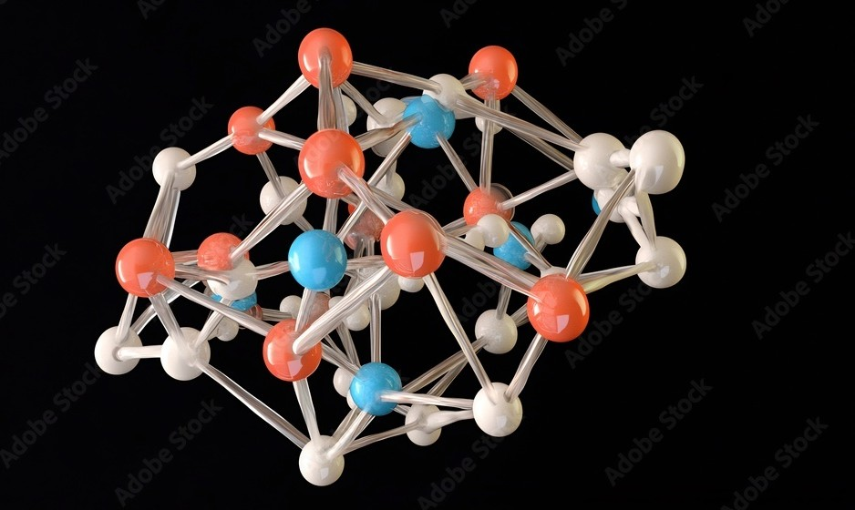
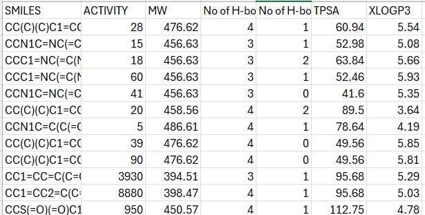
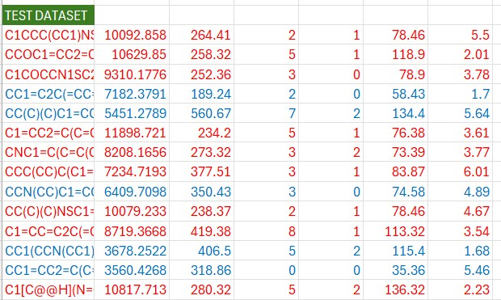
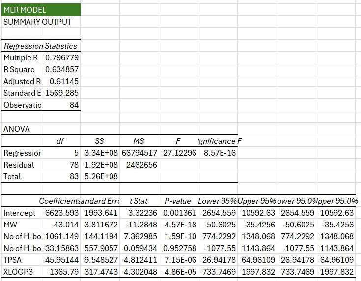

## Table of Contents
- [Introduction](#introduction)
- [Workflow Overview](#workflow-overview)
- [Dataset Preparation](#dataset-preparation)
- [MLR Modeling](#mlr-modeling)
- [Molecular Docking](#molecular-docking)
- [Results Summary](#results-summary)
- [Key Findings](#key-findings)
- [Supplementary Files](#supplementary-files)

---

## Introduction
This project integrates **Multiple Linear Regression (MLR) QSAR modeling** with **molecular docking** to evaluate benzothiazole derivatives as potential therapeutic candidates for prostate cancer.

The workflow combines statistical modeling and structural interaction analysis using PyRx, Discovery Studio, and standard QSAR techniques.

---

## Workflow Overview
```text
1. Dataset cleanup (remove SMILES duplicates)
2. Feature extraction (MW, HBA, HBD, TPSA, XlogP3)
3. MLR model build + evaluation (R² threshold: 0.6+)
4. Docking of high-activity predictions using PyRx
5. Interaction analysis with prostate cancer protein targets
```

---

## Dataset Preparation
- Dataset sourced from **PubChem**
- Duplicate SMILES removed
- Final dataset: **104 compounds**
  - **84 training**
  - **20 test**

### Train Data Subset  


### Test Data Subset  


---

## MLR Modeling

Model features included:

| Descriptor | Meaning |
|-----------|---------|
| MW | Molecular Weight |
| HBA | H-bond Acceptors |
| HBD | H-bond Donors |
| TPSA | Topological Polar Surface Area |
| XlogP3 | Partition Coefficient |
| IC50 | Activity (nM) |

Model quality measured using **R² ≥ 0.6**.

### MLR Model  


---

## Molecular Docking
Docking performed using **PyRx AutoDock Vina**.  
Top 10 predicted compounds from the test set were docked.  
Top 5 best-binding ligands were selected per protein.

### Protein Targets

| Protein | PDB ID |
|--------|--------|
| Androgen Receptor | 1E3G |
| Estrogen Receptor | 6V8T |
| AR Variant | 2AM9 |
| 17β-HSD1 | 1JTV |
| Kallikrein 2 | 4NFE |

### Ligand–Protein Interaction Example  


### Superimposition (Native vs Test Ligand)  


---

## Results Summary

Full tables available in **Supplementary.md**.

### Binding Affinity Summary

| Protein | Best Ligand | Affinity (kcal/mol) |
|--------|-------------|----------------------|
| 1E3G | Lubeluzole | -7.6 |
| 6V8T | Mefenacet / Lubeluzole / Tozadenant | -7.4 |
| 2AM9 | Lubeluzole | -8.4 |
| 1JTV | Quizartinib | -10.4 |
| 4NFE | Lubeluzole | -8.2 |

---

## Key Findings
- MLR model provided meaningful structure–activity relationships.
- Lubeluzole, Quizartinib, Mefenacet, and Coumarin-6 showed strong docking performance.
- Native ligands consistently scored lower (better binding), validating docking accuracy.

---

## Supplementary Files
See **Supplementary_MLR_Docking_Data.md** for:  
✔ Full docking tables  
✔ Ligand–Protein Interaction gallery  
✔ Native Ligand interactions  
✔ Benchmark docking results  
