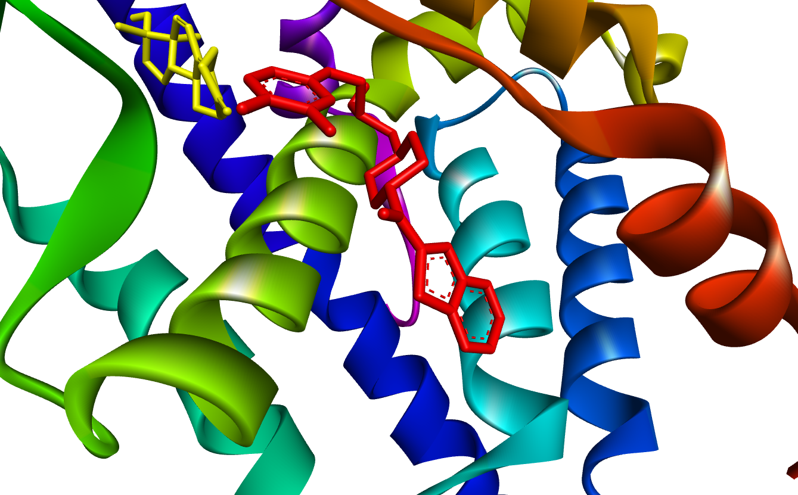
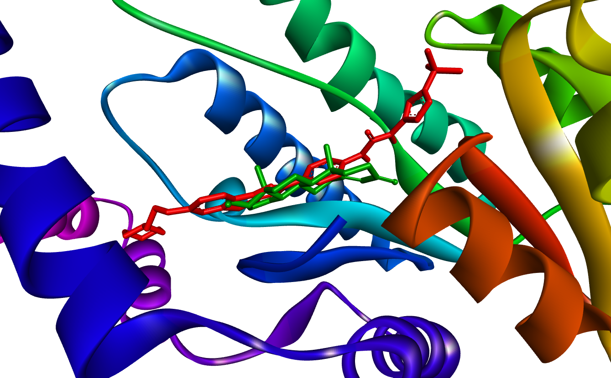
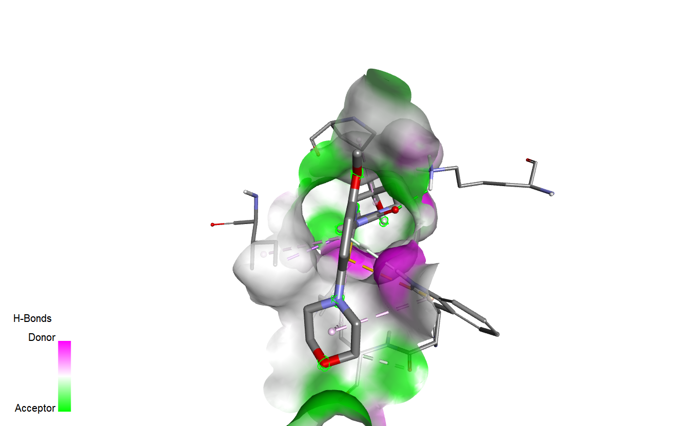
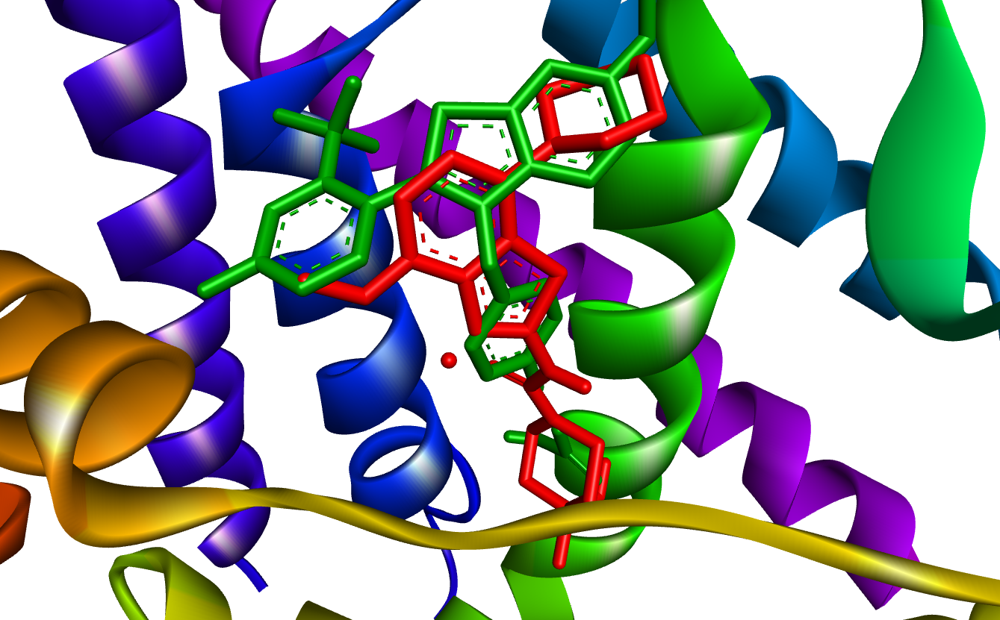
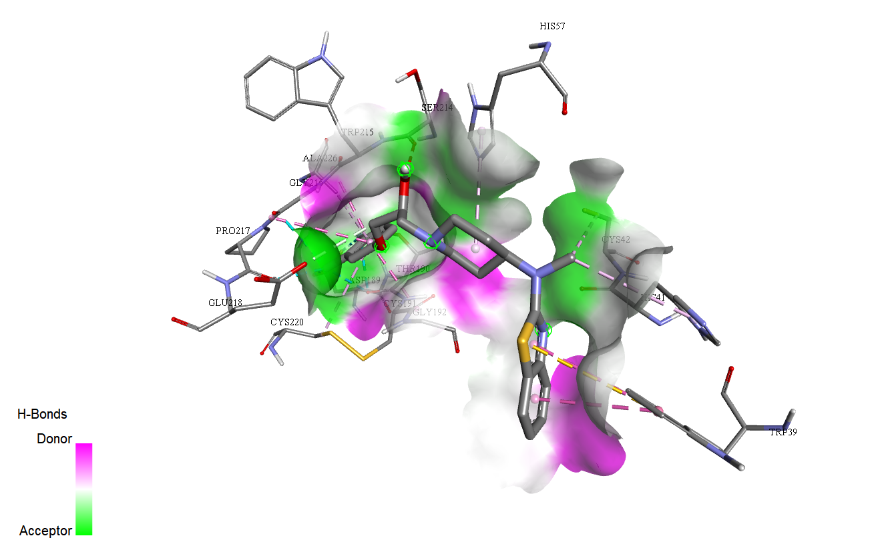
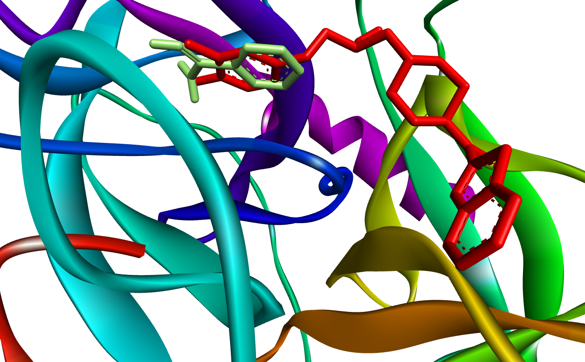

# Supplementary Data – Integrative MLR–Docking Study

This file contains the complete set of docking tables and results.

---

## Benchmarks
Native and control ligands (from PDB structures) are included as benchmark references to validate docking results.

| Protein (PDB) | Native ligand (CID) | Control ligand(s) (CID) |
|---------------:|--------------------:|------------------------:|
| 1E3G | Metribolone (261000) | Hydrochlorothiazide (3639), Enzalutamide (15951529) |
| 6V8T | LSZ102 (118574930) | Hydrochlorothiazide (3639), Enzalutamide (15951529) |
| 2AM9 | Testosterone (6013) | Hydrochlorothiazide (3639), Enzalutamide (15951529) |
| 1JTV | Testosterone (6013) | Hydrochlorothiazide (3639), Enzalutamide (15951529) |
| 4NFE | Benzamidine (2332) | Hydrochlorothiazide (3639), Enzalutamide (15951529) |

---

## Table 1 – Androgen Receptor (1E3G)
| Ligand | PubChem CID | Binding Affinity (kcal/mol) |
|--------|-------------|-----------------------------|
| Lubeluzole | 65998 | -7.6 |
| Mefenacet | 91716 | -7.5 |
| Coumarin 6 | 100334 | -7.5 |
| Thioflavin T | 16954 | -7.3 |
| Tricyclazole | 39040 | -7.3 |
| Native: Metribolone | 261000 | -10.6 |
| Control: Hydrochlorothiazide | 3639 | -7.4 |
| Control: Enzalutamide | 15951529 | -0.7 |

## Ligand-Protein and Native-Ligand-Protein 3D Interactions  

---

## Table 2 – 17-β-HSD Type I (1JTV)
| Ligand | PubChem CID | Binding Affinity (kcal/mol) |
|--------|-------------|-----------------------------|
| Quizartinib  | 24889392   | -10.4 |
| Bentamapimod | 1019520   | -9.3 |
| Lubeluzole | 65998 | -9.1 |
| Coumarin 6 | 100334  | -8.2 |
| Mefenacet  | 91716   | -8.1 |
| Native: Testosterone | 6013 | -7.8 |
| Control: Hydrochlorothiazide | 3639 | -6.7 |
| Control: Enzalutamide | 15951529 | -9.0 |

## Ligand-Protein and Native-Ligand-Protein 3D Interactions  

---

## Table 3 – Estrogen Receptor (6V8T)
| Ligand | PubChem CID | Binding Affinity (kcal/mol) |
|--------|-------------|-----------------------------|
| Mefenacet | 91716 | -7.4 |
| Lubeluzole | 65998 | -7.4 |
| Tozadenant | 11618368 | -7.4 |
| Tricyclazole | 39040 | -6.8 |
| Dimazole | 8708 | -6.3 |
| Native: LSZ102 | 118574930 | -6.9 |
| Control: Hydrochlorothiazide | 3639 | -6.3 |
| Control: Enzalutamide | 15951529 | -3.1 |

## Ligand-Protein and Native-Ligand-Protein 3D Interactions  

---

## Table 4 – Kallikrein 2 (4NFE)
| Ligand | PubChem CID | Binding Affinity (kcal/mol) |
|--------|-------------|-----------------------------|
| Lubeluzole | 65998 | -8.2 |
| Bentamapimod | 1019520 | -7.2 |
| Mefenacet | 91716 | -7.2 |
| Coumarin 6 | 100334 | -6.8 |
| Tozadenant | 11618368 | -6.5 |
| Native: Benzamidine | 2332 | -5.4 |
| Control: Hydrochlorothiazide | 3639 | -6.0 |
| Control: Enzalutamide | 15951529 | -7.1 |

## Ligand-Protein and Native-Ligand-Protein 3D Interactions

---

## Table 5 – Androgen Receptor (2AM9)
| Ligand | PubChem CID | Binding Affinity (kcal/mol) |
|--------|-------------|-----------------------------|
| Lubeluzole | 65998 | -8.4 |
| Coumarin 6 | 100334 | -8.0 |
| Mefenacet | 91716 | -7.9 |
| Tozadenant | 11618368 | -7.6 |
| Thioflavin T | 16954 | -7.0 |
| Native: Testosterone | 6013 | -10.9 |
| Control: Hydrochlorothiazide | 3639 | -6.9 |
| Control: Enzalutamide | 15951529 | -4.5 |

## Ligand-Protein and Native-Ligand-Protein 3D Interactions  

---

